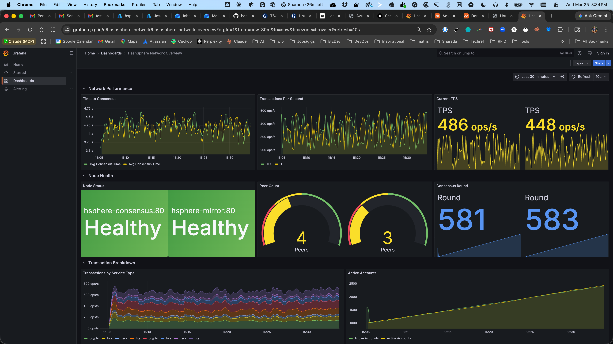

# HashSphere Azure Foundation

Infrastructure-as-code for deploying a simulated Hedera Hashgraph network on Azure Container Apps, with Prometheus + Grafana observability built in.



**Live dashboard:** [grafana.jxp.io](https://grafana.jxp.io)

## Architecture

```
                    Internet
                       |
                       v
              [Grafana :3000]  ← grafana.jxp.io (managed TLS)
                       |
                       v
             [Prometheus :9090]  ← internal, scrapes every 15s
                       |
          +------------+------------+
          v                         v
  [Consensus Node :8080]    [Mirror Node :8080]
     simulated HCS          simulated mirror
```

All containers run in an Azure Container Apps environment on a delegated VNet subnet (`10.0.0.0/23`). Internal services communicate over ACA's built-in DNS. Grafana is the only externally exposed service.

## Components

| Container | Image | Resources | Description |
|-----------|-------|-----------|-------------|
| `hsphere-consensus` | `ghcr.io/mikestankavich/hsphere-node-simulator` | 0.25 vCPU / 0.5Gi | Go service simulating Hedera consensus rounds |
| `hsphere-mirror` | `ghcr.io/mikestankavich/hsphere-node-simulator` | 0.25 vCPU / 0.5Gi | Same image in mirror role, simulating transaction indexing |
| `hsphere-prometheus` | `ghcr.io/mikestankavich/hsphere-prometheus` | 0.5 vCPU / 1.0Gi | Prometheus with baked-in scrape config targeting both nodes |
| `hsphere-grafana` | `ghcr.io/mikestankavich/hsphere-grafana` | 0.25 vCPU / 0.5Gi | Grafana with provisioned datasource and dashboard |

All images are public on GHCR.

### Node Simulator Metrics

The Go node simulator exposes `/metrics` on port 8080:

| Metric | Type | Description |
|--------|------|-------------|
| `hashsphere_consensus_time_seconds` | histogram | Time to consensus per round |
| `hashsphere_transactions_total` | counter | Total transactions by service type |
| `hashsphere_transactions_per_second` | gauge | Current TPS |
| `hashsphere_round_number` | counter | Current consensus round |
| `hashsphere_active_accounts` | gauge | Currently active accounts |
| `hashsphere_peer_count` | gauge | Connected peers |
| `hashsphere_node_status` | gauge | Health status (1=healthy, 0=unhealthy) |

Health endpoint: `GET /healthz`

## Prerequisites

- [Terraform](https://www.terraform.io/) >= 1.5
- [Azure CLI](https://learn.microsoft.com/en-us/cli/azure/)
- [Docker](https://www.docker.com/)
- [just](https://just.systems/)
- [direnv](https://direnv.net/) (optional, auto-loads `.env.local`)

## Quick Start

```bash
# 1. Configure environment
cp .env.local.example .env.local
# Edit .env.local with your Azure subscription and tenant IDs

# 2. Authenticate
az login

# 3. Bootstrap Terraform state backend (one-time)
just bootstrap-state

# 4. Initialize and deploy
just init
just plan    # review changes
just apply   # deploy infrastructure

# 5. Build and push container images
just push
```

## CI/CD

GitHub Actions workflow at `.github/workflows/terraform.yml`:

- **Pull requests** → `terraform plan` with output posted as a PR comment
- **Merge to main** → `terraform apply -auto-approve` (changes to `terraform/` only)

Authentication uses Azure OIDC federated credentials — no client secrets to rotate. See [OIDC Setup](#oidc-setup) below.

### OIDC Setup

Create an Azure AD app registration with federated credentials for GitHub Actions:

```bash
# Create app registration and service principal
az ad app create --display-name "hashsphere-ci"
az ad sp create --id <APP_ID>

# Grant Contributor on your subscription
az role assignment create \
  --assignee <APP_ID> \
  --role Contributor \
  --scope /subscriptions/<SUBSCRIPTION_ID>

# Federated credential for PR plan jobs
az ad app federated-credential create --id <APP_ID> --parameters '{
  "name": "github-hashsphere-pr",
  "issuer": "https://token.actions.githubusercontent.com",
  "subject": "repo:<OWNER>/<REPO>:pull_request",
  "audiences": ["api://AzureADTokenExchange"]
}'

# Federated credential for apply on merge
az ad app federated-credential create --id <APP_ID> --parameters '{
  "name": "github-hashsphere-main",
  "issuer": "https://token.actions.githubusercontent.com",
  "subject": "repo:<OWNER>/<REPO>:ref:refs/heads/main",
  "audiences": ["api://AzureADTokenExchange"]
}'
```

Set three GitHub repo secrets: `AZURE_CLIENT_ID`, `AZURE_TENANT_ID`, `AZURE_SUBSCRIPTION_ID`.

## Available Commands

| Command | Description |
|---------|-------------|
| `just validate` | Check dependencies and Azure connectivity |
| `just bootstrap-state` | Create Azure Storage for Terraform state (run once) |
| `just init` | Initialize Terraform |
| `just plan` | Preview infrastructure changes |
| `just apply` | Deploy infrastructure |
| `just destroy` | Tear down all infrastructure |
| `just build` | Build all container images locally |
| `just push` | Build and push images to GHCR |
| `just status` | Show current infrastructure state |
| `just debug` | Print tool versions and Azure account info |
| `just fmt` | Format Terraform files |

## Infrastructure

Managed by Terraform (`terraform/`):

- **Resource Group** — `rg-hashsphere-dev-ussc`
- **VNet** — `10.0.0.0/16` with ACA-delegated subnet and NSG
- **Container Apps Environment** — with Log Analytics (30-day retention)
- **4 Container Apps** — consensus, mirror, prometheus, grafana (all `min_replicas=1`)
- **State backend** — Azure Blob Storage in `hashsphere-tfstate`

Provider: `azurerm ~> 4.0`

## Project Structure

```
.
├── .github/workflows/
│   └── terraform.yml      # CI: plan on PR, apply on merge
├── containers/
│   ├── node-simulator/    # Go simulated Hedera node
│   ├── prometheus/        # Prometheus with baked-in scrape config
│   └── grafana/           # Grafana with provisioned datasource + dashboard
├── docs/
│   └── dashboard.png      # Dashboard screenshot
├── terraform/
│   ├── provider.tf        # Azure provider + state backend
│   ├── main.tf            # Resource group + naming
│   ├── variables.tf       # Input variables
│   ├── network.tf         # VNet, subnet, NSG
│   ├── container-app.tf   # ACA environment + Log Analytics
│   ├── hedera-node.tf     # Consensus + mirror container apps
│   ├── observability.tf   # Prometheus + Grafana container apps
│   ├── outputs.tf         # Grafana URL, resource names
│   └── init.sh            # State backend bootstrap script
├── justfile               # Task runner commands
├── .env.local.example     # Environment template
└── .envrc                 # direnv auto-loader
```

## License

[MIT](LICENSE)
